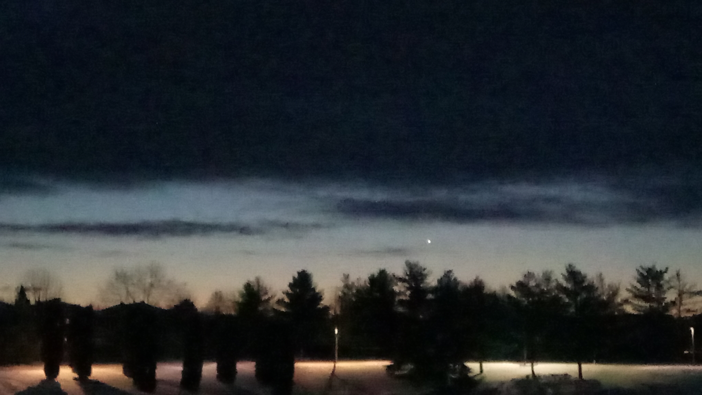

Just in time for Christmas. Our friends at Gatsby were very kind with this nice present for the V4 Early Adaptors. A BIG Thank you.

We are very exited about all new additions and improvements. Keep the good work going.

In this first post of 2022 winter, the cold tempearature has been a big factor and it can't be overstated.

Also, with the so called freedom protests taking place these days, it is very notieceable that societies are engaged in an important civil unrests testing whether relying on democracy or some kind of autocracy can help systems to survive  contestations from within.

---

---

## lets test some image format sizing

Diffrent image formatting options are highlited in the following.

### image Source

using html width wrapper 100%

width 125%

height 20%. It looks like height has no effect here.

---

It looks like the height attribute has no effect of the image final size.

---

---

height 40%

width 125%

